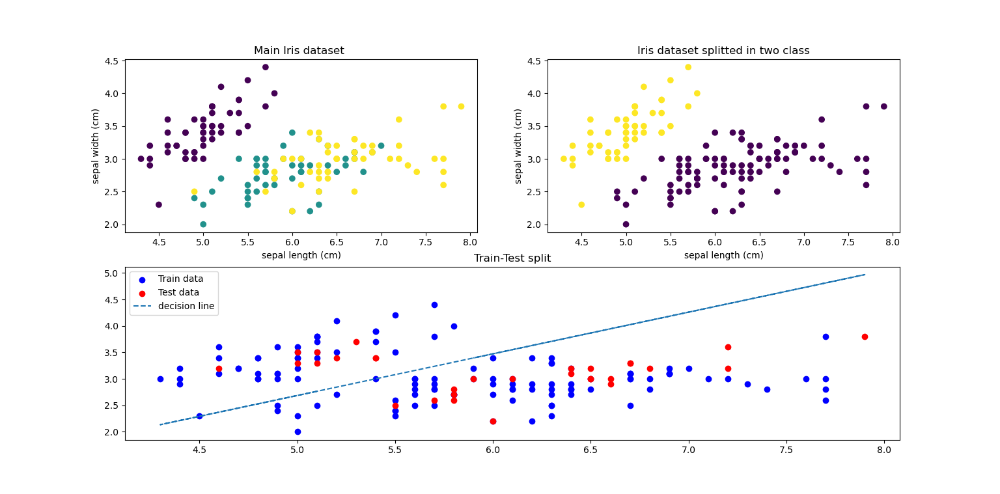
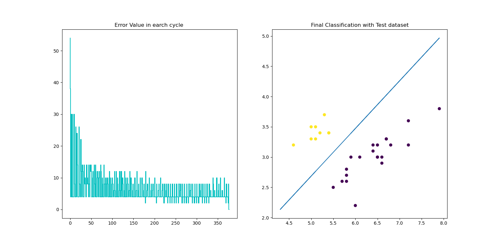
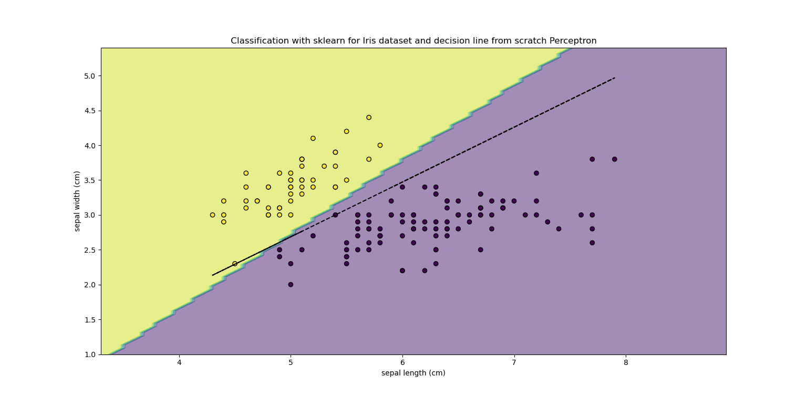

# Single layer perceptron from scratch 
## Develop a perceptron from scratch and compare its performance with the sklearn LinearRegression for binary classification tasks on Iris dataset

The Iris dataset is a classic dataset in machine learning and consists of 150 samples of iris flowers, each with four features (sepal length, sepal width, petal length,and petal width) and a target label indicating the species of iris.

This Project Task: Use the Iris dataset for binary classification by considering only two classes. Train your perceptron on this dataset and compare its performance with the sklearn Perceptron class.

  
   
  
   
  

